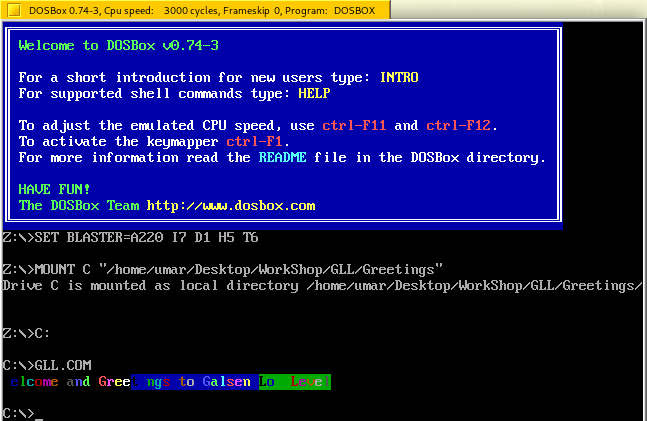

<div>


<div>
</div>

 <a href="https://github.com/Galsen-Low-Level/"></a>


A simple 'Hello World' like program  but says “Greetings” at the assembly level.
It uses the Netwide Assembly language, known as NASM.
You can install  it  from the web  or from your package manager 
Check [nasm-installation](https://www.nasm.us/) 


<hr>
So we have two programs that say “Greetings”. 
- form [MS-DOS](https://en.wikipedia.org/wiki/MS-DOS) 
- form the [MBR-Bootloader](https://en.wikipedia.org/wiki/Bootloader)

#### MS-DOS  

The file `greeting_from_dos.asm` : 
is a simple program that says “Greetings...” from an MS-DOS application using the MS-DOS interrupt function call to print it from standard output. 
to print from standard output. 
This program requires to have [dosbox-emulator](https://www.dosbox.com/download.php?main=1) application already install.
See your package manager  if the [dosbox-emulator](https://www.dosbox.com/download.php?main=1) is available first :) 


#### MBR-Bootloader 

MBR stand for Master Boot Record
more info see [MBR](https://en.wikipedia.org/wiki/Master_boot_record) 
For more info about [Qemu](https://en.wikipedia.org/wiki/QEMU)

The `greeting_from_bootloader.asm` file is identical to that in MS-DOS
is identical to that of MS-DOS, but uses the BIOS interception call.
It is a simple boot file used by many operating systems, but contains only a welcome message and the boot signature at the end.

This program requires [Qemu](https://www.qemu.org/) to be available on your machine.
Or check your package manager.

#### Build Stage 
You have at your disposal a makefilefile, which you can use to compile.
Please feel free to consult the file 


here are some instructions, depending on the target you wish to use  generate

###### For MS-DOS 

```bash   
$ >  make  ms-dos   # to generate the executable for bosbox 
$ >  make  launch-dosbox  # to launch dosbox application 
```

###### For Qemu/MBR 

```bash 
$ >  make boot-mbr   # to Generate the MBR  file 
$ >  make run-qemu   # launch qemu emulation and execute the MBR file 
```

- To clean or delete the generated file, type `make clean`.
- To generate all files, simply type `make`.


##### ScreenShots 
#### DOSBOX 
 

#### Qemu 

 


Feel free to contribute.

We ❤️  Computers at all Levels. 

From Senegal. 🇸🇳
